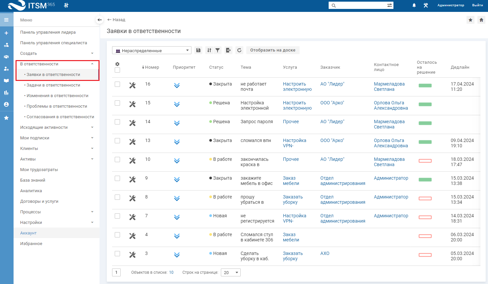
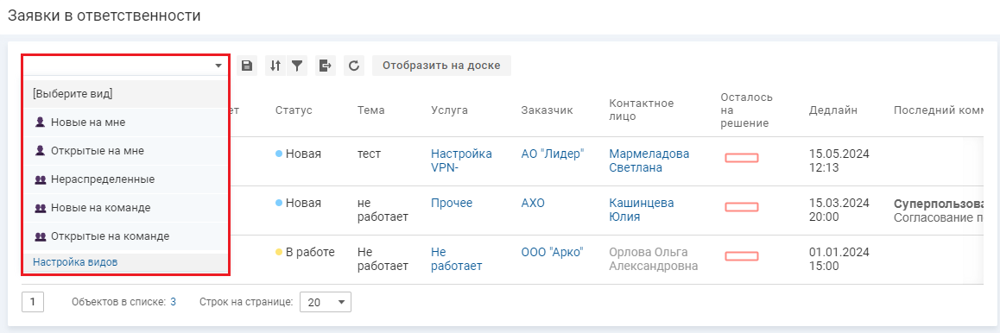
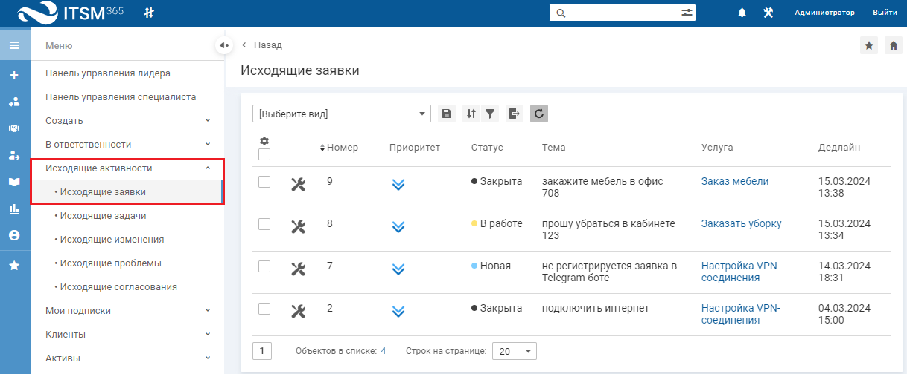
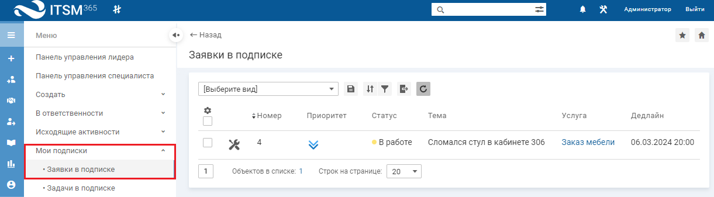
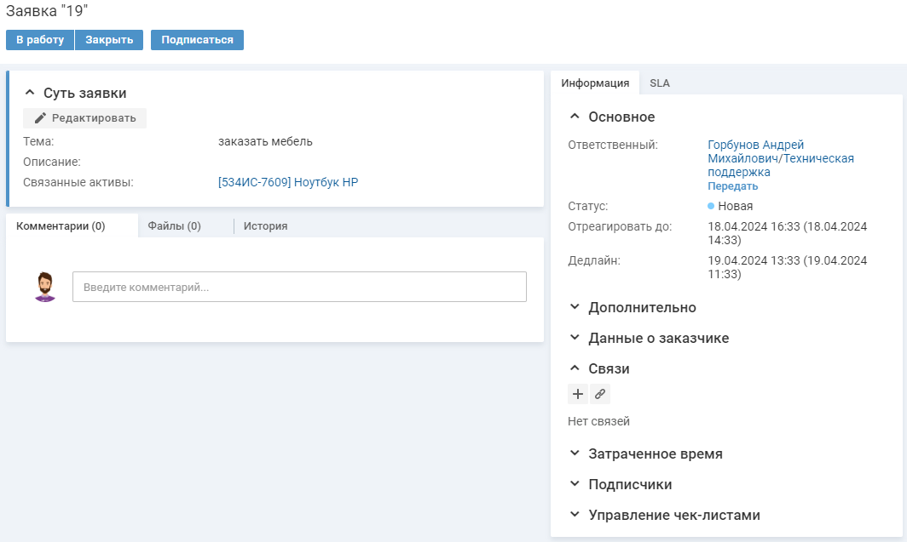

# Список заявок и карточка заявки

## Список заявок

### Заявки в ответственности

Чтобы посмотреть список заявок, в левом меню выберите "В ответственности" → "Заявки в ответственности".

Для просмотра доступны следующие виды списка заявок:

*   "Новые на мне" — в списке отображаются заявки в статусе "Новая", находящиеся в персональной ответственности специалиста.
*   "Открытые на мне" — в списке отображаются заявки в статусе "В работе" и "Новая", находящиеся в персональной ответственности специалиста.
*   "Нераспределенные" — в списке отображаются заявки в ответственности команды без персональной ответственности специалиста.
*   "Новые в команде" — в списке отображаются заявки в статусе "Новая", находящиеся в ответственности команды специалиста.
*   "Открытые в команде" — в списке отображаются заявки в статусе "В работе" и "Новая", находящиеся в ответственности команды специалиста.

### Исходящие заявки

Чтобы посмотреть список заявок, в левом меню выберите "Исходящие активности" → "Исходящие заявки".

### Заявки в подписке

Чтобы посмотреть список заявок, в левом меню выберите "Мои подписки" → "Заявки в подписке".

Подписчики заявки будут получать оповещения о событиях, связанных с заявкой (добавление приватного комментария, смена статуса). У подписчиков есть возможность отписаться от заявки, [подробнее](Inc_2.htm#04).

## Карточка заявки

Специалист может просмотреть всю информацию о конкретной заявке в карточке заявки.

Чтобы перейти в карточку заявки, нажмите на название заявки в списке.

Информация на карточке заявки структурирована по блокам и вкладкам:

*   блок "Суть заявки" — содержит тему, описание заявки и связанные активы.
*   вкладка "Информация":
    
    *   "Основное" — содержит параметры заявки: "Ответственный", "Статус", "Отреагировать до" и "Дедлайн".
    *   "Дополнительно" — содержит информацию о заказчике, связанном договоре, услуге, типе заявки, способе обращения и приоритете.
    *   "Данные о заказчике" — содержит контактные данные заказчика.
    *   "Связи" — позволяет добавить связь с существующим изменением, задачей, согласованием или проблемой или создать новую активность, связанную с заявкой, [подробнее](Inc_3.htm#03).
    *   "Затраченное время" — содержит информацию о ТЗТ на заявку, [подробнее](Inc_3.htm#09).
    *   "Подписчики" — содержит информацию о подписчиках на заявку, [подробнее](Inc_2.htm#04).
    *   "Управление чек-листами".
*   блок "База знаний" — содержит статьи базы знаний, связанные с услугой заявки, [подробнее](Inc_3.htm#02).
*   вкладка "SLA" — содержит информацию о критериях расчета SLA и временные параметры заявки.
*   вкладка "Комментарии" — содержит комментарии к заявке, [подробнее](Inc_3.htm#08).
*   вкладка "Файлы" — содержит список файлов, прикрепленных к заявке, [подробнее](Inc_3.htm#05).
*   вкладка "История" — отображает последовательность изменения объекта.

Блоки на карточке заявки можно развернуть для просмотра на всю страницу, нажав иконку в правом верхнем углу блока. Иконка отображается при наведении курсора на блок.