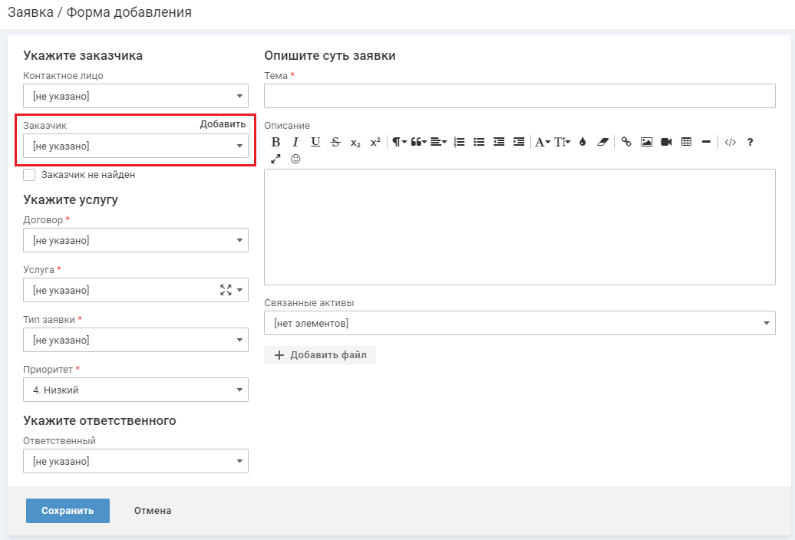

# Регистрация заявки

Пользователь может зарегистрировать заявку самостоятельно одним из следующих способов: по электронной почте, через Личный кабинет, через Мобильное приложение. Заявку от клиента могут зарегистрировать специалисты сервисного подразделения. В качестве альтернативного канала подачи заявок клиентами можно настроить Telegram бот.

Если функциональность "Приоритет в заявке" используется в ваших бизнес-процессах, то вы можете включить его в интерфейсе технолога в разделе "Настройка бизнес процессов → Метки", включив метку ["Приоритет в заявке"](../technolog/metki_ITSM.htm).

*   Регистрация заявок от специалиста
*   Регистрация заявки по электронной почте
*   Регистрация заявки, используя Telegram бот

## Регистрация заявок специалистом

Регистрация заявки от заказчика

Для регистрации заявки выполните следующие действия:

1.  В левом меню выберите "Создать" → "Заявку от заказчика".
    
    
    
    Откроется форма добавления заявки.
    
    
    
2.  В блоке "Укажите заказчика" заполните поля:
    
    *   "Контактное лицо" — выберите ФИО пользователя, который обратился по поводу данного сбоя.
        
        

        Если пользователь не найден, его можно добавить.
        
        Чтобы добавить контактное лицо заявки, наведите курсор на поле и нажмите "Добавить". На форме добавления заполните поля и нажмите кнопку "Сохранить", [подробное описание полей формы](../org/user_add.htm).
        
        
        
    *   "Заказчик" — выберите отдел или компанию.
        
        
        
        *   Если в качестве заказчика выбрана компания-клиент, то на форме добавления заявки отобразится блок "Выберите объект обслуживания":
            
            *   "Объект обслуживания" — выберите объект обслуживания, на котором требуется провести работы в рамках заявки.
            *   "Адрес объекта" — заполняется автоматически, если адрес заполнен у объекта обслуживания, адрес можно уточнить.
                
                Если адрес не указан, поле можно заполнить вручную, указав адрес объекта обслуживания, на котором требуется провести работы в рамках заявки.

            
            
        *   Если нужного заказчика нет в системе, можно добавить новую компанию или отдел. Чтобы добавить клиента, наведите курсор на поле и нажмите "Добавить". На форме добавления заполните поля и нажмите кнопку "Сохранить", [подробное описание полей формы](../org/OU.htm#03).
            
            
            
    *   "Заказчик не найден" — установите флажок, если заказчик не определен. Заполните данные контактного лица для взаимодействия по заявке в блоке "Введите контактные данные": контактное лицо, email и телефон (блок отображается на форме после установки флажка). В этом случае новое контактное лицо в системе не создается.  
        
        
        
3.  В блоке "Укажите услугу" заполните поля:
    
    *   "Договор";
    *   "Услуга";
    *   "Тип заявки";
    *   "Приоритет".
        
        Приоритет и услуга влияют на SLA заявки. Если приоритет не заполнен, то по умолчанию заявке присваивается "4. Низкий".
        
        Возможные значения:
        
        *   1\. Критический.
        *   2\. Высокий.
        *   3\. Средний.
        *   4\. Низкий.
        
        Приоритет включается/выключается при помощи метки "Приоритет в заявке", [подробнее](../technolog/metki_ITSM.htm).
        
        После включения/выключения возможны следующие ситуации:
        
        *   Если в системе был включен функционал "Приоритет в заявке" и для правил SLA приоритет был указан, а потом метку выключили, то приоритет продолжит действовать, но в интерфейсе отображаться не будет.
        *   Если в системе была начата работа без приоритета, а затем он был включен, то все ранее созданные заявки будут иметь низкий приоритет.
4.  В блоке "Укажите ответственного" заполните поле:
    
    *   "Ответственный" — выберите ответственного исполнителя заявки.
        
        Если ответственный не выбран, то он определится по настроенным правилам автоматизации:
        
        *   Если для услуги / договора / компании настроено правило автоматизации назначения ответственного, то ответственный за заявку определяется по данному правилу.
            
        *   Если для услуги / договора / компании правило автоматизации назначения ответственного не настроено, то назначается ответственный по умолчанию.
            
            Ответственный по умолчанию задается в правиле автоматизации "Маршрутизация заявок". В правиле указывается команда, которая будет назначаться ответственной за те заявки, для которых не определен ответственный по другим правилам автоматизации.
            
        
        Для настройки ответственного за услугу, договор, компанию или за заявки по умолчанию необходимо настроить соответствующее правило автоматизации, [подробнее](process_inc_2.htm#02).
        
5.  В блоке "Опишите суть заявки" заполните поля:
    
    *   "Тема" — введите краткое описание возникшего сбоя или ошибки.
    *   "Описание" — введите описание возникшего сбоя или ошибки. В описание можно вставлять скриншоты из буфера обмена (ctrl+v).
    *   "Связанные активы" — выберите ИТ-активы, находящиеся в использовании контактного лица, его отдела / компании / объекта обслуживания или общедоступный актив.
    
    К создаваемой заявке можно прикрепить файл, нажав кнопку "+ Добавить файл".
    
6.  Нажмите кнопку "Сохранить".

В системе будет зарегистрирована заявка в статусе "Новая".

Все заявки, зарегистрированные в системе, отображаются в списке заявок, [подробнее](Inc_6.htm).

## Регистрация заявки от себя

Специалист может зарегистрировать заявку от себя в качестве контактного лица в рамках внутренней поддержки.

Чтобы добавить заявку, выполните следующие действия:

1.  В левом меню выберите "Создать" → "Заявку от себя".
    
    
    
2.  На первом шаге выберите популярную услугу или тематику для создания заявки из предложенных на плашках.
    
3.  На следующем шаге выберите нужную услугу (шаг может повторяться).
    
    
    
    Откроется форма добавления заявки.

    
    
    
4.  В блоке "Укажите услугу" будут заполнены поля:
    
    *   "Договор".
    *   "Услуга".
    *   "Приоритет".
        
        Приоритет и услуга влияют на SLA заявки. Если приоритет не заполнен, то по умолчанию заявке присваивается "4. Низкий".
        
        Возможные значения:
        
        *   1\. Критический.
        *   2\. Высокий.
        *   3\. Средний.
        *   4\. Низкий.
        
        Приоритет включается/выключается при помощи метки "Приоритет в заявке", [подробнее](../technolog/metki_ITSM.htm).
        
        После включения/выключения возможны следующие ситуации:
        
        *   Если в системе был включен функционал "Приоритет в заявке" и для правил SLA приоритет был указан, а потом метку выключили, то приоритет продолжит действовать, но в интерфейсе отображаться не будет.
        *   Если в системе была начата работа без приоритета, а затем он был включен, то все ранее созданные заявки будут иметь низкий приоритет.
            
5.  В блоке "Укажите ответственного" заполните поле:
    
    *   "Ответственный" — выберите ответственного исполнителя заявки.
        
        Если ответственный не выбран, то он определится по настроенным правилам автоматизации:
        
        *   Если для услуги / договора / компании настроено правило автоматизации назначения ответственного, то ответственный за заявку определяется по данному правилу.
        *   Если для услуги / договора / компании правило автоматизации назначения ответственного не настроено, то назначается ответственный по умолчанию.
            
            Ответственный по умолчанию задается в правиле автоматизации "Маршрутизация заявок". В правиле указывается команда, которая будет назначаться ответственной за те заявки, для которых не определен ответственный по другим правилам автоматизации.
            
        
        Для настройки ответственного за услугу, договор, компанию или за заявки по умолчанию необходимо настроить соответствующее правило автоматизации, [подробнее](process_inc_2.htm#02).
        
6.  В блоке "Рекомендуемые статьи" будут отображаться ссылки на статьи базы знаний, если с услугой, по которой регистрируется заявка, связаны статьи базы знаний, [подробнее](../kw_base/k_base_02.htm#14).
7.  В блоке "Опишите суть заявки" заполните поля:
    
    *   "Тема" — введите краткое описание возникшего сбоя или ошибки.
    *   "Описание" — введите описание возникшего сбоя или ошибки. В описание можно вставлять скриншоты из буфера обмена (ctrl+v).
    *   "Связанные активы" — выберите ИТ-активы, находящиеся в использовании контактного лица, его отдела / компании / объекта обслуживания или общедоступный актив.
    
    К создаваемой заявке можно прикрепить файл, нажав кнопку "+ Добавить файл".
    
8.  Нажмите кнопку "Сохранить".

В системе будет зарегистрирована заявка в статусе "Новая".

Все заявки, зарегистрированные в системе, отображаются в списке заявок, [подробнее](Inc_6.htm).

## Регистрация заявки по электронной почте

Пользователь может отправить заявку по электронной почте:

*   Зарегистрированный пользователь отправляет письмо-заявку на единый электронный адрес сервисной службы. На основе письма в системе автоматически регистрируется заявка.
*   Незарегистрированный пользователь может регистрировать заявки по электронной почте, если это разрешено [настройками системы](../setting/settings_mail.htm#01).
    
    Незарегистрированный пользователь отправляет письмо-заявку на единый электронный адрес сервисной службы. На основе письма в системе автоматически регистрируется заявка.
    

Все заявки, зарегистрированные в системе, отображаются в [списке заявок](Inc_6.htm).  

## Регистрация заявки, используя Telegram бот

Для регистрации заявки через Telegram у пользователя должна быть учетная запись в ITSM 365 или в системе должно быть разрешено создание заявок от незарегистрированных пользователей. Во втором случае будут автоматически создаваться учетные записи для таких пользователей без доступа в интерфейс системы.

### Как пользователю начать работу с Telegram-ботом

Найдите бота по названию, установленному компанией, в поисковой строке Telegram.

При первом обращении бот отправит сообщение с правилами использования.

### Как зарегистрировать заявку

Для регистрации заявки напишите боту сообщение, которое станет описанием новой заявки.

При нажатии кнопки "Посмотреть в ITSM 365" можно перейти на карточку созданной заявки в веб-интерфейсе системы.

### Как ответить по заявке
Когда сотрудник сервисной службы оставит публичный комментарий по заявке, текст комментария отправится пользователю в Telegram.
Для ответа напишите боту комментарий и выберите одну из открытых заявок, чтобы добавить комментарий.

### Как узнать решение по заявке
Когда сотрудник сервисной службы переводит заявку в статус "Выполнено", пользователь получает оповещение в Telegram и может возобновить заявку или закрыть с оценкой.

